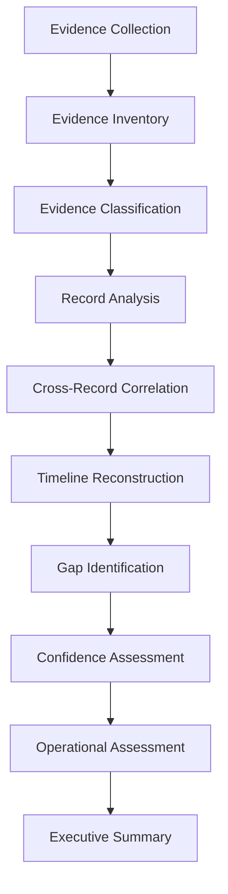
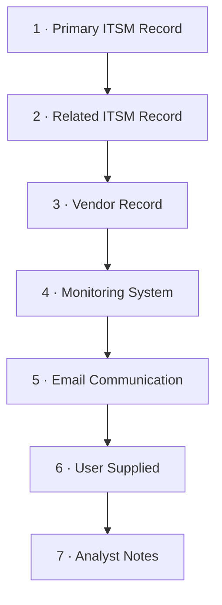
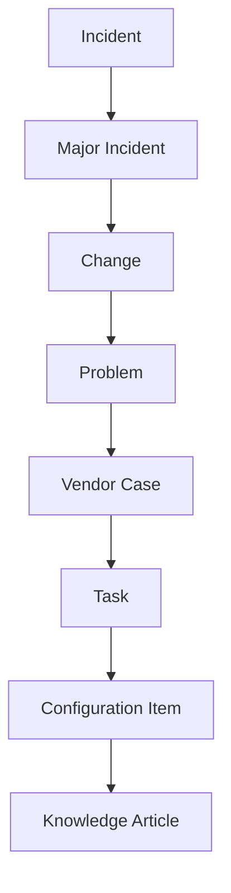
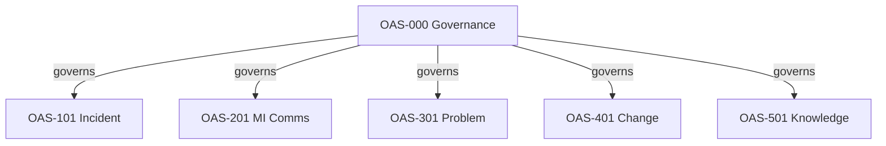

# Operational Analysis Standard (OAS)

---

# Document Control

| Field | Value |
|---------|--------|
| Standard | Operational Analysis Standard |
| Identifier | OAS-000 |
| Version | 1.1 |
| Status | Approved |
| Framework Alignment | ITIL 4 |
| Applies To | Operational Analysis |
| Review Cycle | Annual |

---

# 1 Purpose

The Operational Analysis Standard (OAS) establishes a single, organisation-wide methodology for analysing operational records across the IT Service Management (ITSM) lifecycle.

## 1.1 Intent

Operational analysis is performed constantly — after incidents, during major incidents, before and after changes, and when problems are investigated. Without a common method, each analyst produces a different artefact, conclusions are hard to compare, evidence is interpreted inconsistently, and leadership cannot trust that "analysis" means the same thing from one team to the next. OAS exists to remove that variability.

## 1.2 What OAS Delivers

- **Consistency** — the same analytical structure regardless of author or record type.
- **Evidential rigour** — every conclusion is traceable to a source.
- **Repeatability** — a second analyst can reproduce the analysis from the same evidence.
- **Auditability** — reviewers and auditors can see how each conclusion was reached.
- **Vendor neutrality** — conclusions do not depend on any specific tool or vendor.
- **Tool independence** — the method works whether the source is ServiceNow, another ITSM platform, or exported artefacts.

## 1.3 Relationship to ITIL and ServiceNow

- **ITIL 4** — OAS is *aligned* with ITIL practices (Incident, Problem, Change, Major Incident, Knowledge Management). It adopts ITIL terminology and the continual-improvement mindset but is a *documentation and analysis* standard, not a process standard.
- **ServiceNow** — the **reference implementation**. Examples use ServiceNow record types, related lists, and XML exports; ServiceNow XML is treated as authoritative structured evidence.
- **Other platforms** — the methodologies are platform-agnostic where practical. No organisation-specific ServiceNow customisation is assumed, so the methods remain portable.

OAS analyses the *outputs* of ITIL processes and ServiceNow records. It does **not** redefine how those processes are executed, nor does it replace them.

## 1.4 What OAS Is Not

- It is not a root cause tool in itself — it governs *how* root cause is assessed (see OAS-301).
- It is not a process-improvement framework — it produces evidence that feeds improvement.
- It is not a substitute for human judgement — AI assistance is permitted but human validation is mandatory (§14).

---

# 2 Scope

This standard applies to analysis performed against operational records including, but not limited to:

- Incidents (INC)
- Major Incidents (MI)
- Changes (CHG)
- Problems (PRB/PBI)
- Knowledge Articles
- Tasks
- Vendor Cases
- Monitoring Alerts
- Configuration Items
- Email Communications
- Supporting Documentation

**In scope:** the analytical process — how evidence is collected, classified, correlated, assessed, and presented.

**Out of scope:** the operational processes that *produce* the records (Incident Management, Change Enablement, etc.), platform configuration, and tool administration.

---

# 3 Objectives

The standard exists to:

1. **Establish a common analytical methodology** so analyses are comparable.
2. **Improve consistency between analysts** regardless of team or seniority.
3. **Improve AI-assisted analysis** by giving the model a fixed, evidence-first frame.
4. **Improve evidence traceability** so every claim points to a source.
5. **Separate facts from assumptions** explicitly and consistently.
6. **Improve executive reporting** through a standard output set.
7. **Improve technical reporting** with structured, defensible findings.
8. **Standardise operational documentation** across the library.

---

# 4 Guiding Principles

Every analysis shall adhere to the following principles. They are not optional and they are the basis on which analyses are reviewed.

## 4.1 Evidence First

**Rule:** Analysis shall only be based on available evidence. Missing evidence shall never be replaced with assumptions.

**Rationale:** An analysis that fills gaps with assumption produces confident but false conclusions. It is always better to report "Unknown" than to invent a cause.

**Example:** If a Problem record states "root cause was DNS", but no DNS log, vendor statement, or test evidence supports it, the analyst records the stated cause as a *Vendor/Record Statement* and assigns **Low/Unknown** confidence — not as a verified fact.

## 4.2 Objectivity

**Rule:** Analysis shall remain impartial. Operational conclusions shall be supported by documented evidence.

**Rationale:** Operational analysis is frequently performed after a difficult event. Objectivity prevents the analysis from becoming a narrative that protects individuals or teams.

## 4.3 Traceability

**Rule:** Every significant conclusion shall be traceable to one or more evidence sources.

**Rationale:** Traceability is what makes an analysis auditable and lets a reviewer challenge a conclusion by examining its evidence.

## 4.4 Transparency

**Rule:** Where confidence is limited, the analyst shall explicitly state why.

**Rationale:** Stakeholders make decisions on the basis of analysis. Hidden uncertainty is a defect; stated uncertainty is a feature.

## 4.5 Separation of Fact and Opinion

The following classes shall never be presented interchangeably:

| Class | Definition |
|-------|------------|
| **Facts** | Supported directly by evidence. |
| **Observations** | Describe what occurred, as recorded. |
| **Inferences** | Logical conclusions derived from multiple evidence sources. |
| **Hypotheses** | Possible explanations under investigation. |
| **Recommendations** | Suggested future actions. |

**Rationale:** Confusing an inference with a fact, or a hypothesis with a conclusion, is the most common failure mode in operational reporting.

---

# 5 Analysis Philosophy

Operational analysis is **not** the process of explaining what happened.

Operational analysis is the process of **determining what the available evidence supports**.

The objective is to *reduce uncertainty while maintaining analytical integrity*. Where the evidence is insufficient, the honest output is a narrower, lower-confidence conclusion — not a speculative one.

---

# 6 Analysis Lifecycle



Every analysis shall follow the same lifecycle. This is the *conceptual* sequence of analytical stages; the operational execution workflow is provided in Appendix C.

| Stage | Description |
|-------|-------------|
| Evidence Collection | Gather all available artefacts (XML, .eml, chat, bridge notes, timelines). |
| Evidence Inventory | List what was received and classify its state (§8). |
| Evidence Classification | Classify each finding (§9) and assess source authority (§7). |
| Record Analysis | Analyse the primary record independently. |
| Cross-Record Correlation | Correlate with related records only after independent analysis. |
| Timeline Reconstruction | Build a chronology from evidence. |
| Gap Identification | Record missing or contradictory evidence. |
| Confidence Assessment | Assign confidence to significant conclusions (§10). |
| Operational Assessment | Assess response, impact, governance. |
| Executive Summary | Produce the standard output set (§16). |

---

# 7 Evidence Hierarchy



Operational evidence shall be evaluated according to its authority. Higher-priority sources are preferred when sources conflict, but authority never exempts a source from challenge.

| Priority | Source | Guidance |
|-----------|----------|----------|
| 1 | Primary ITSM Record | The record under analysis (e.g., the Incident XML). Treat as authoritative for its own fields. |
| 2 | Related ITSM Record | Records linked to the primary (e.g., a Problem referenced by an Incident). |
| 3 | Vendor Record | Vendor RCA, support cases. Useful but commercially interested. |
| 4 | Monitoring System | APM, synthetic, infrastructure monitoring. Strong for technical state. |
| 5 | Email Communication | Operational and stakeholder emails. Context-rich, often informal. |
| 6 | User Supplied Documentation | Screenshots, self-reports. Variable reliability. |
| 7 | Analyst Notes | The analyst's own observations. Lowest authority; never used to fill gaps. |

**Conflict handling:** Where evidence conflicts, the analyst shall (a) document the conflict, (b) identify the affected conclusions, and (c) avoid selecting one source without justification. Authority may inform which source is *presumed* correct, but a high-priority source that contradicts multiple independent lower-priority sources still requires reconciliation, not blind preference.

---

# 8 Evidence States

Every required evidence source shall be classified.

| State | Description | Analytical treatment |
|----------|-------------|----------------------|
| Present | Evidence supplied | Analyse directly. |
| Referenced | Mentioned but unavailable | Note as referenced; do not rely on it. |
| Missing | Expected but absent | Record as a gap; lower confidence accordingly. |
| Not Applicable | Not required | Exclude from gap analysis. |

---

# 9 Evidence Classification

Every extracted finding shall be classified.

| Classification | Description | Example |
|----------------|-------------|---------|
| Fact | Directly supported | "INC0012345 was opened at 02:14." |
| Observation | Behaviour observed | "Three reassignment loops occurred before assignment." |
| Inference | Logical conclusion | "Reassignment suggests the initial assignment group was incorrect." |
| Hypothesis | Working theory | "A recent change may have introduced the fault." |
| Vendor Statement | Vendor supplied | "Vendor confirmed a known defect in v4.2." |
| Recommendation | Proposed action | "Add a monitoring threshold on connection pool exhaustion." |

---

# 10 Confidence Model

Every significant finding shall include a confidence rating.

| Rating | Description | When to use |
|----------|-------------|-------------|
| High | Supported by multiple independent evidence sources | At least two independent sources agree. |
| Moderate | Supported by one authoritative source | A single primary/related record supports it. |
| Low | Limited supporting evidence | One weak or indirect source, or partial support. |
| Unknown | Evidence unavailable | Required evidence is Missing/Referenced. |

**Rule:** Confidence shall never be implied. If a finding has no rating, the analysis is incomplete.

---

# 11 Record Relationships



Operational records exist within a service management ecosystem.

```text
Incident
   ↓
Major Incident
   ↓
Change
   ↓
Problem
   ↓
Vendor Case
   ↓
Task
   ↓
Configuration Item
   ↓
Knowledge Article
```

**Rule:** No record shall automatically be assumed to explain another. Relationships shall be established using evidence, not assumed from linkage alone. A Problem referenced by an Incident is *evidence of a relationship*, not proof that the Problem explains the Incident.

---

# 12 Correlation Standard

Each record shall first be analysed independently. Only after independent analysis shall correlation occur.

Correlation seeks to determine:

- **chronology** — what happened when, across records.
- **causation** — whether one event likely caused another (stated as inference/hypothesis, not fact, unless evidence proves it).
- **dependency** — whether records depended on each other.
- **operational impact** — combined business/technical effect.
- **recovery** — how service was restored.
- **remaining risk** — what is unresolved.

---

# 13 Missing Information

Missing information shall never be inferred.

Where required information is absent the analyst shall record:

```text
Missing Information : Root Cause
Required Evidence   : Problem Record (PRB000789)
Reason              : Problem still in progress; RCA not yet documented
Impact to Confidence: Low — operational response can still be assessed; causality cannot.
```

The analysis proceeds on the evidence available and states clearly what cannot be concluded.

---

# 14 AI Assisted Analysis

Artificial Intelligence **may** assist in:

- evidence extraction
- summarisation
- timeline reconstruction
- correlation
- documentation

Artificial Intelligence **shall not**:

- invent evidence
- infer unsupported conclusions
- conceal uncertainty
- modify timestamps
- rewrite operational history

**Human validation remains mandatory.** Any AI-generated analysis must be reviewed and signed off by a human analyst who confirms the evidence supports each conclusion.

---

# 15 Required Inputs

Every analysis shall begin with an **Evidence Manifest**.

```text
Primary Record : INC0012345.xml
Related Records: PRB000789.xml, CHG001122.xml
Communications : Update 1.eml, Update 2.eml, Bridge Notes.docx
Supporting     : app-logs.zip, APM-export.json
```

The manifest makes the evidence boundary explicit and is the first item a reviewer checks.

---

# 16 Required Outputs

Every completed analysis shall contain:

| Output | Purpose |
|--------|---------|
| Executive Summary | Decision-grade summary for leadership. |
| Evidence Manifest | What was supplied and its state. |
| Timeline | Reconstructed chronology. |
| Current State | Where the service/record stands now. |
| Operational Findings | What happened operationally. |
| Business Findings | Business impact and risk. |
| Evidence Matrix | Conclusion → evidence → confidence. |
| Confidence Assessment | Overall and per-finding confidence. |
| Outstanding Questions | What remains unknown. |
| Recommendations | Evidence-based actions. |
| Next Required Evidence | What would close the gaps. |

---

# 17 Quality Assurance

Before publication verify:

- [ ] Evidence inventory complete and states classified
- [ ] Metadata extracted from primary record
- [ ] Timeline validated against sources
- [ ] Facts separated from assumptions
- [ ] Confidence assigned to every significant finding
- [ ] Evidence gaps identified and recorded
- [ ] Recommendations evidence based
- [ ] Executive summary completed
- [ ] Cross-references verified
- [ ] Human validation recorded

---

# 18 Methodology Hierarchy



This standard governs all operational methodologies and governance standards within the OAS library.

| Standard | Category | Primary Record | Purpose |
|----------|----------|----------------|---------|
| OAS-000 | Governance Standard | — | Framework governance |
| OAS-101 | Analysis Methodology | Incident | Incident Analysis |
| OAS-201 | Analysis Methodology | Major Incident | Major Incident Communications |
| OAS-301 | Analysis Methodology | Problem | Problem Analysis |
| OAS-401 | Analysis Methodology | Change | Change Analysis |
| OAS-501 | Governance Standard | Knowledge | Operational Knowledge Standard |

Each methodology and governance standard inherits this standard. Methodologies and standards may extend this standard but shall not contradict it.

## 18.1 Future Expansion (Planned — Not Yet Authored)

The following candidate standards have been identified for future consideration. They are **not** part of Release 1.1 and shall not be referenced as approved standards until authored and ratified under OAS-000 governance.

| Candidate ID | Intended Scope |
|--------------|----------------|
| OAS-601 | Configuration Item Analysis |
| OAS-901 | AI Prompt Standard |

---

# 19 Version Control

This standard shall follow semantic versioning.

- **Major Version** — Breaking methodological change (alters how analysis is performed).
- **Minor Version** — New capabilities or clarifications that do not break method.
- **Patch Version** — Editorial corrections.

Each published version is immutable; changes are issued as a new version with a revision-history entry.

---

# Appendix A — Analyst Code of Conduct

Analysts shall:

- Remain objective.
- Avoid confirmation bias (seek disconfirming evidence).
- Preserve chronology.
- Preserve evidence integrity (never alter source artefacts).
- Distinguish certainty from uncertainty.
- Document assumptions explicitly.
- Escalate unresolved ambiguity rather than resolving it by assumption.

---

# Appendix B — Operational Analysis Principles

Every analysis should answer:

1. What evidence exists?
2. What does the evidence prove?
3. What remains unknown?
4. What additional evidence is required?
5. What operational risks exist?
6. What business risks exist?
7. What recommendations are supported by evidence?

---

# Appendix C — Standard Workflow (Operational Execution)

The analytical lifecycle (§6) is realised through the following operational workflow.

```text
Receive Evidence
        │
        ▼
Inventory Evidence  ..........  build Evidence Manifest, classify states
        │
        ▼
Extract Metadata  ............  pull fields from primary record
        │
        ▼
Validate Evidence  ...........  confirm completeness, note gaps
        │
        ▼
Analyse Record  ..............  independent analysis of primary record
        │
        ▼
Analyse Related Records  .....  independent analysis of each related record
        │
        ▼
Correlate Findings  ..........  only after independent analysis
        │
        ▼
Assess Confidence  ...........  assign ratings per §10
        │
        ▼
Produce Analysis  ............  generate outputs per §16
        │
        ▼
Executive Review  ............  human validation and sign-off
```

---

# Appendix D — Glossary

| Term | Definition |
|------|------------|
| Analysis | The OAS evidence-based assessment of an operational record. |
| Evidence Manifest | The enumerated set of artefacts supplied for analysis. |
| Primary Record | The record under analysis (highest-priority evidence). |
| Related Record | A record linked to, but distinct from, the primary record. |
| Confidence | A rating of how strongly evidence supports a conclusion. |
| Inference | A logical conclusion drawn from multiple evidence sources. |
| Hypothesis | A possible explanation still under investigation. |
| Traceability | The property that a conclusion can be linked to its evidence. |

---

# Revision History

| Version | Date | Summary | Author | Reviewer |
|----------|------|---------|---------|----------|
| 0.1 | YYYY-MM-DD | Initial draft | | |
| 1.0 | 2026-07-23 | Promoted to Approved; corrected methodology hierarchy (§18); aligned metadata to Standard Metadata schema | Operations — OAS Working Group | Operations — Standards Governance Board |
| 1.1 | 2026-07-23 | Elaborated for comprehensiveness: expanded principles with rationale and examples, evidence hierarchy guidance, confidence examples, glossary, and workflow annotations | Operations — OAS Working Group | Operations — Standards Governance Board |

---

# Future Revision Register

| ID | Status | Priority | Proposed Version | Enhancement |
|----|--------|----------|------------------|-------------|
| OAS000-001 | Proposed | Medium | 1.2 | Evidence Traceability Matrix (formal mapping of conclusions to evidence) |
| OAS000-002 | Proposed | Low | 1.2 | Worked example annex for each methodology |
| OAS000-003 | Proposed | Low | 2.0 | Author OAS-601 Configuration Item Analysis |
| OAS000-004 | Proposed | Low | 2.0 | Author OAS-901 AI Prompt Standard |

---

End of Standard
