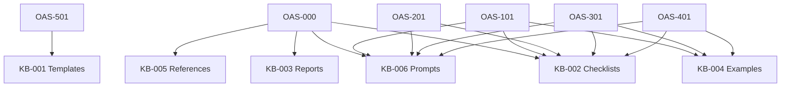

# Knowledge Base

> **Status:** Authored (Release 1.2.0). Derived from the approved OAS standards.
> The Knowledge Base supports consistent execution of OAS and shall never supersede
> Governance Standards (OAS-000, OAS-501) or Analysis Methodologies.

## Purpose

The Knowledge Base contains reusable operational assets that support consistent
implementation of the OAS standards. Every asset is **derived** from the frozen standards
— not the reverse.

## Authored Assets (OAS-KB-001 … OAS-KB-006)

| ID | Folder | Derived from | Contents |
|----|--------|--------------|----------|
| OAS-KB-001 | `templates/` | OAS-501 | Operational Knowledge Templates (article, runbook, known error, work instruction) |
| OAS-KB-002 | `checklists/` | OAS-000, OAS-101, OAS-201, OAS-301, OAS-401 | Analysis Checklists (consolidated QA checklists) |
| OAS-KB-003 | `reports/` | OAS-000 §16 | Report Templates (analysis report, executive summary, evidence manifest, evidence matrix, confidence) |
| OAS-KB-004 | `examples/` | OAS-101, OAS-201, OAS-301, OAS-401 | Operational Examples (full worked analyses) |
| OAS-KB-005 | `references/` | OAS-000 | Reference Guides (evidence hierarchy, confidence model, normative language, ServiceNow mapping, glossary) |
| OAS-KB-006 | `prompts/` | OAS-000 §14, all methodologies | Prompt Library (AI-assisted analysis prompts) |

## Derived-From Map

## Dependency Note

The Knowledge Base depends on the standards. It was authored only after the governing
standards were frozen (OAS 1.1.0). See the top-level `README.md` for the current release
status.

---

*End of Knowledge Base README.*
