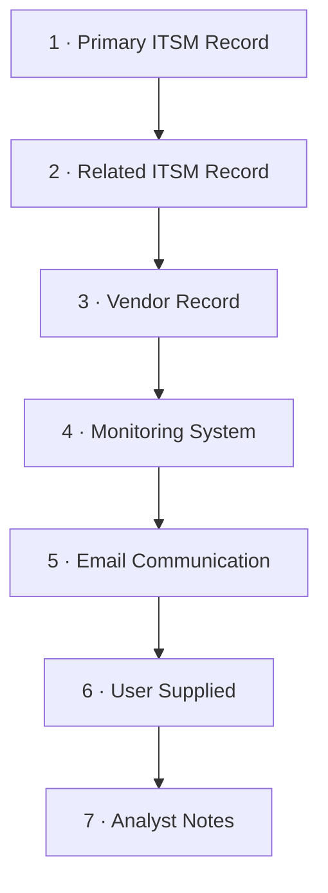

# OAS-KB-005 Reference Guides

## Purpose

Quick-reference cards distilled from **OAS-000**. Keep these open during analysis.

---

## A. Evidence Hierarchy (OAS-000 §7)

| Priority | Source | Use |
|----------|--------|-----|
| 1 | Primary ITSM Record | Authoritative for its own fields |

| 2 | Related ITSM Record | Linked records |
| 3 | Vendor Record | Useful but commercially interested |
| 4 | Monitoring System | Strong for technical state |
| 5 | Email Communication | Context-rich, informal |
| 6 | User Supplied Documentation | Variable reliability |
| 7 | Analyst Notes | Lowest authority; never fill gaps |

**Conflict rule:** Document the conflict, identify affected conclusions, and do **not**
silently prefer one source. Authority informs presumption, not proof.

---

## B. Evidence States (OAS-000 §8)

- **Present** — supplied and analysed
- **Referenced** — mentioned but not supplied
- **Missing** — expected but absent
- **Not Applicable** — not required

---

## C. Evidence Classification (OAS-000 §9)

- **Fact** — directly supported
- **Observation** — what occurred, as recorded
- **Inference** — logical conclusion from multiple sources
- **Hypothesis** — theory under investigation
- **Vendor Statement** — vendor supplied
- **Recommendation** — proposed action

Never present these interchangeably.

---

## D. Confidence Model (OAS-000 §10)

| Rating | Use when |
|--------|----------|
| High | Multiple independent sources agree |
| Moderate | One authoritative source |
| Low | Limited / partial support |
| Unknown | Evidence unavailable |

Confidence is **never** implied — if a finding lacks a rating, the analysis is incomplete.

---

## E. Normative Language (OAS Library)

| Term | Meaning |
|------|---------|
| Shall | Mandatory requirement |
| Should | Strong recommendation |
| May | Optional |
| Must Not | Prohibited |

---

## F. ServiceNow Field Mapping (Reference Implementation)

| OAS Concept | ServiceNow Field / Table |
|-------------|--------------------------|
| Incident | `incident` (INC) |
| Major Incident | `incident` with `major_incident_state` / `made_major` |
| Problem | `problem` (PRB/PBI) |
| Change | `change_request` (CHG) |
| Knowledge | `kb_knowledge` |
| Configuration Item | `cmdb_ci` |
| Assignment Group | `assignment_group` |
| State transitions | `sys_audit` / state history |
| Work notes | `work_notes` / journal |
| Created time | `sys_created_on` |
| Priority / Impact / Urgency | `priority`, `impact`, `urgency` |

Treat exported XML as authoritative structured evidence (OAS design context).

---

## G. Glossary

| Term | Definition |
|------|------------|
| Analysis | OAS evidence-based assessment of a record |
| Evidence Manifest | Enumerated supplied artefacts |
| Primary Record | Record under analysis (highest-priority evidence) |
| Related Record | Linked but distinct record |
| Confidence | Rating of evidential support for a conclusion |
| Inference | Logical conclusion from multiple sources |
| Hypothesis | Possible explanation under investigation |
| Traceability | Conclusion links to its evidence |

---

*End of OAS-KB-005.*
