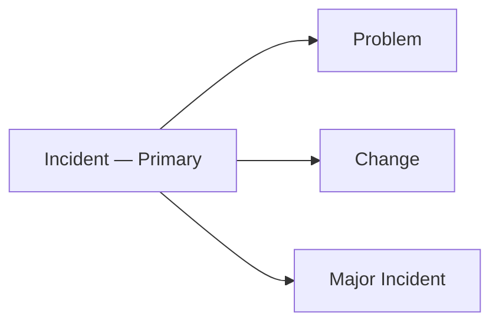

# OAS-101 Incident Analysis Methodology

## Purpose

The Incident Analysis Methodology establishes a structured, evidence-based approach for analysing operational incidents to determine what occurred, how the incident was managed, the operational impact, and opportunities for continual improvement.

The methodology evaluates the **operational response** to an incident using documented evidence while preserving traceability between observations, findings, and recommendations.

### What this methodology delivers

- A reconstructed, evidence-based incident timeline.
- An objective assessment of how the incident was handled.
- A clear statement of business and technical impact.
- An evaluation of the quality of the Incident record itself.
- Evidence-based recommendations and lessons learned.

### What it is not

- It does **not** perform detailed Root Cause Analysis — that is OAS-301.
- It does **not** evaluate Major Incident communications in depth — that is OAS-201.
- It does **not** assess Change implementation quality — that is OAS-401.

---

## Scope

This methodology applies to ServiceNow Incident records and equivalent ITSM Incident records.

The methodology evaluates:

- Incident chronology
- Operational response
- Service restoration
- Impact assessment
- Governance observations
- Evidence quality
- Operational findings
- Recommendations
- Lessons learned

Where related records exist, they may be used to enrich the analysis but shall **not** replace the Incident record as the primary evidence source.

---

## Definitions

| Term | Definition |
|------|------------|
| Priority | ServiceNow-derived urgency × impact ranking (1–5). Drives SLA. |
| Severity | Technical seriousness of the fault (often separate from priority). |
| Assignment Group | Team responsible for working the incident. |
| Reassignment | Movement of an incident between groups. |
| MTTR | Mean Time To Resolve / Restore. |
| Restoration | Service returned to acceptable operation (may be workaround). |
| Resolution | Underlying issue addressed; incident closable. |

---

## Guiding Principles

Incident analysis shall:

- Be evidence based.
- Preserve chronological accuracy.
- Evaluate operational actions objectively.
- Distinguish observations from conclusions.
- Clearly identify evidence limitations.
- Produce practical recommendations for continual improvement.

---

## Inputs

### Mandatory

- Incident XML (primary evidence).

### Optional Supporting Evidence

- Problem XML
- Change XML
- Major Incident XML
- Email (.eml)
- Timeline documents
- Bridge notes
- Teams chat exports
- Vendor communications
- Knowledge articles
- Supporting work notes

---

## Required Evidence

Review available evidence including:

- Incident metadata
- Assignment history
- Work notes
- State transitions
- Impact and urgency
- Priority
- Configuration Items
- Service information
- Resolution details
- Closure information
- Related records

Every evidence source listed above shall be classified using the Evidence States model defined in OAS-000 §8 — **Present**, **Referenced**, **Missing**, or **Not Applicable**. Unavailable evidence that may influence analytical confidence shall be recorded explicitly rather than assumed.

---

## Analysis Methodology

### Phase 1 — Incident Context

**Objective:** Establish what was affected and how seriously, before judging the response.

Establish:

- Business service affected
- Configuration Item(s)
- Business impact
- Technical impact
- Priority
- Severity
- Users or services affected

**Guidance:** Confirm the operational context before assessing response activities. The priority recorded on the incident may not match the actual business impact — note any mismatch as a finding.

**Common pitfall:** Starting with "why did it break" before establishing "what was affected" leads to mis-scoped analysis.

---

### Phase 2 — Timeline Reconstruction

**Objective:** Build a defensible chronology from evidence.

Include:

- Detection
- Logging
- Assignment
- Escalation
- Investigation
- Mitigation
- Restoration
- Resolution
- Closure

**Guidance:** Chronology shall be evidence based. Use the Incident XML `sys_created_on`, state transitions, and work-note timestamps. Where timestamps conflict (e.g., email says 02:00 but work note says 02:40), identify the discrepancy explicitly rather than silently choosing one.

**Common pitfall:** Reconstructing the timeline from memory or a single source; failing to reconcile conflicting times.

---

### Phase 3 — Operational Response

**Objective:** Determine how effectively the incident was *managed*, not whether the technical fix was correct.

Assess:

- Ownership (was there a clear owner throughout?)
- Assignment progression (was it assigned to the right group promptly?)
- Escalation (was it escalated appropriately and in time?)
- Investigation activities (were the right diagnostic steps taken?)
- Coordination (were teams coordinated?)
- Technical actions (were actions appropriate and recorded?)
- Service restoration activities (was restoration achieved efficiently?)

**Indicators of strength:** Single clear owner; assignment within SLA; documented escalation; investigation steps recorded in work notes.

**Indicators of weakness:** Multiple silent reassignments; ownership gaps; escalation only after user pressure; no recorded rationale for actions.

---

### Phase 4 — Impact Assessment

**Objective:** Confirm the actual impact against the recorded impact.

Assess:

- Business impact
- Service impact
- Customer impact
- Duration
- Scope
- Operational disruption

**Guidance:** Confirm whether recorded impact (priority/urgency) accurately reflects available evidence. Over- or under-classification is a governance finding, not a technical judgement.

---

### Phase 5 — Evidence Quality

**Objective:** Evaluate the quality of the Incident record itself.

Assess:

- Completeness
- Chronological consistency
- Work note quality
- Technical detail
- Resolution documentation
- Closure documentation

**Guidance:** Incomplete documentation shall be identified as an **evidence limitation** rather than interpreted as operational failure. A silent incident is not necessarily a mishandled incident — but it is an evidence gap that lowers confidence in any positive conclusion.

---

### Phase 6 — Related Record Assessment

Where available, evaluate related records for consistency.

#### Problem

Confirm whether:

- Root cause investigation exists.
- Problem references align with the Incident.

#### Change

Confirm whether:

- Incident resulted from a Change.
- Corrective Change implemented.
- Related Change references are consistent.

#### Major Incident

Where the Incident formed part of a Major Incident:

Confirm consistency between Incident chronology and Major Incident records.

Detailed communications assessment remains within OAS-201.

---

### Phase 7 — Governance Observations

**Objective:** Identify process and governance signals without over-reaching.

Assess:

- Assignment practices
- Escalation practices
- Documentation quality
- Ownership
- Record maintenance
- Operational compliance

**Guidance:** Do not assess process compliance beyond the available evidence. If the record does not show whether a control was applied, record it as Unknown — do not assume non-compliance.

---

## Findings

Identify:

- Operational strengths
- Operational weaknesses
- Governance observations
- Risks
- Positive practices

Separate factual observations from analytical conclusions. Classify each finding per OAS-000 §9.

---

## Worked Example (Illustrative)

**Incident:** INC0012345 — "Checkout service returning 500 errors."

| Element | Evidence | Assessment |
|---------|----------|------------|
| Detection | `sys_created_on` 02:14, alert at 02:15 | Timely detection. |
| Assignment | Assigned to NOC at 02:16; reassigned to App team 02:40 | One reassignment, documented rationale. |
| Escalation | Major Incident declared 02:55 (after 40 min) | Escalation delay relative to customer impact — finding. |
| Restoration | Workaround deployed 03:30 | Restored within window. |
| Resolution | Root cause (bad deploy) fixed via CHG001122 at 05:10 | Resolution evidence present. |
| Closure | Closed 06:00 with impact notes | Adequate. |

**Conclusion:** Operationally well-handled on response; escalation timing and the initiating Change (CHG001122) are the primary improvement areas. Confidence: **High** for response; **Moderate** for causality (relies on Change record).

---

## Confidence Assessment

Assign a confidence rating to every significant finding using the OAS-000 Confidence Model (§10):

| Rating | Description |
|--------|-------------|
| High | Supported by multiple independent evidence sources |
| Moderate | Supported by one authoritative source |
| Low | Limited supporting evidence |
| Unknown | Evidence unavailable |

Confidence shall never be implied. Where evidence is limited or contradictory, record the affected findings as **Low** or **Unknown** and state the reason explicitly. The confidence assessment shall be reflected in the analysis outputs (OAS-000 §16).

---

## Recommendations

Recommendations shall be:

- Evidence based
- Practical
- Actionable
- Prioritised where appropriate

Typical categories include:

- Operational improvements
- Documentation improvements
- Escalation improvements
- Monitoring improvements
- Knowledge improvements
- Automation opportunities

Where recommendations require Root Cause Analysis or Change implementation, reference OAS-301 or OAS-401 respectively.

**Example recommendation table:**

| ID | Recommendation | Category | Priority | Basis |
|----|----------------|----------|----------|-------|
| R1 | Auto-declare Major Incident when checkout error rate > 5% | Monitoring | High | Escalation delay finding |
| R2 | Link CHG001122 to INC0012345 at deployment | Governance | Medium | Causality traceability |

---

## Lessons Learned

Capture lessons that improve future Incident Management.

Lessons may include:

- Detection
- Triage
- Investigation
- Escalation
- Restoration
- Coordination
- Documentation
- Operational governance

Lessons shall be supported by evidence and written to improve future operational performance.

---

## Quality Assurance Checklist

Before completing the analysis verify:

- [ ] Operational context established
- [ ] Timeline reconstructed and conflicts reconciled
- [ ] Required evidence reviewed (and states classified)
- [ ] Operational response assessed
- [ ] Impact assessed (recorded vs actual)
- [ ] Evidence quality evaluated
- [ ] Related records considered where available
- [ ] Governance observations documented
- [ ] Findings supported by evidence and classified
- [ ] Confidence assigned to findings
- [ ] Recommendations evidence based
- [ ] Lessons Learned documented

---

## AI Operating Standard

When analysing an Incident:

1. Establish operational context.
2. Reconstruct the incident timeline.
3. Validate evidence completeness (classify Evidence States).
4. Assess operational response.
5. Evaluate business and technical impact.
6. Assess documentation quality.
7. Consider related records where available.
8. Distinguish observations from findings.
9. Assign confidence to findings.
10. Produce evidence-based recommendations.
11. Capture actionable Lessons Learned.

The AI shall not infer root cause without supporting evidence and shall explicitly identify where evidence is incomplete or unavailable.

---

## Related Standards

- OAS-000 Operational Analysis Standard Governance
- OAS-201 Major Incident Communications Methodology
- OAS-301 Problem Analysis Methodology
- OAS-401 Change Analysis Methodology
- OAS-501 Operational Knowledge Standard

---

## Related Knowledge Base

- OAS-KB-001 Operational Knowledge Templates
- OAS-KB-002 Analysis Checklists

---

## Revision History

| Version | Date | Summary | Author | Reviewer |
|----------|------|---------|---------|----------|
| 1.0 | 2026-07-23 | Initial approved release | | |
| 1.1 | 2026-07-23 | Elaborated for comprehensiveness: definitions, per-phase guidance, indicators of strength/weakness, worked example, recommendation table | | |

---

## Future Revision Register

| ID | Status | Priority | Proposed Version | Enhancement |
|----|--------|----------|------------------|-------------|
| OAS101-001 | Proposed | Medium | 1.2 | Incident Detection Assessment Framework |
| OAS101-002 | Proposed | Medium | 1.2 | Incident Documentation Quality Guidance |
| OAS101-003 | Proposed | Low | 2.0 | Operational Readiness Assessment |
| OAS101-004 | Proposed | Low | 2.0 | Incident Timeline Visualisation Standard |

---

End of Standard
