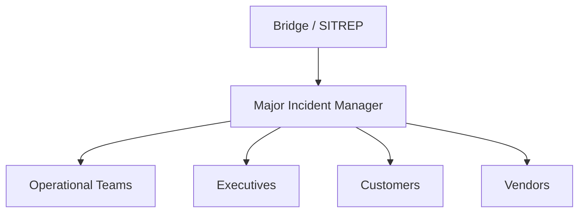
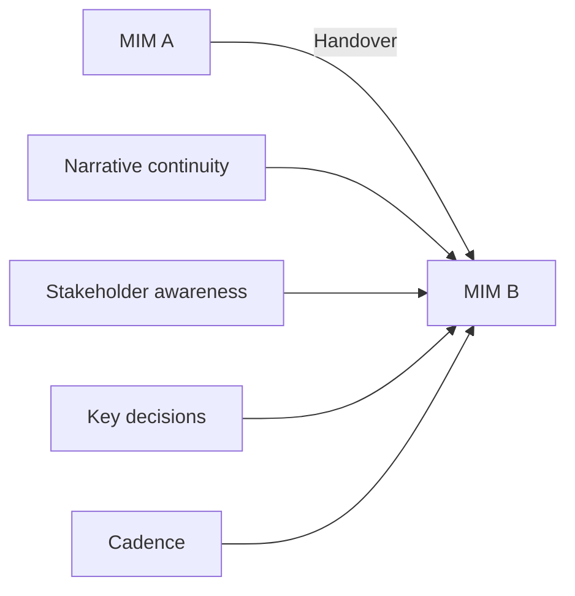

# OAS-201 Major Incident Communications Methodology

## Purpose

The Major Incident Communications Methodology establishes a structured, evidence-based approach for evaluating communications throughout the lifecycle of a Major Incident.

The methodology assesses the effectiveness, timeliness, consistency, clarity, and governance of communications provided to operational teams, stakeholders, customers, and executives.

### What this methodology delivers

- A reconstructed communication timeline.
- An assessment of communication quality and timeliness.
- A stakeholder-by-stakeholder evaluation.
- An assessment of Major Incident Manager (MIM) handover continuity.
- Evidence-based recommendations for communication improvement.

### What it is not

This methodology evaluates **how the incident was communicated**, not how the technical incident was resolved. Technical analysis remains within OAS-101 and OAS-301.

---

## Scope

This methodology applies to Major Incidents managed through ServiceNow or equivalent ITSM platforms.

It evaluates communications generated throughout the Major Incident lifecycle including:

- Operational updates
- Executive communications
- Customer notifications
- Vendor communications
- Major Incident bridge activities
- Major Incident Manager (MIM) handovers
- Timeline documentation

---

## Definitions

| Term | Definition |
|------|------------|
| MIM | Major Incident Manager — owns coordination and comms during a major incident. |
| SITREP | Situation Report — periodic status update. |
| Bridge | Coordinated voice/video conference for real-time coordination. |
| Stakeholder group | A distinct audience with different information needs (ops, exec, customer, vendor). |
| Handover | Transfer of MIM role between individuals. |
| Cadence | The agreed frequency of updates. |

---

## Guiding Principles

Major Incident communications shall:

- Be evidence based.
- Maintain an accurate operational narrative.
- Support informed decision making.
- Provide appropriate stakeholder awareness.
- Balance technical accuracy with audience suitability.
- Remain timely, consistent, and actionable.

---

## Inputs

### Mandatory

- Major Incident XML

### Optional Supporting Evidence

- Situation Reports (SITREPs)
- Executive Updates (.eml)
- Customer Notifications (.eml)
- Vendor Communications
- Email (.eml)
- Teams Chat Exports
- Bridge Notes
- Timeline Documents

Where timeline documentation is unavailable, the Major Incident XML shall be used to reconstruct the operational timeline.

---

## Required Evidence

Review available evidence including:

- Major Incident metadata
- Timeline
- Work notes
- Communication records
- Stakeholder updates
- Email communications
- Bridge notes
- Teams conversations
- Vendor communications
- Related Incident references

Every evidence source listed above shall be classified using the Evidence States model defined in OAS-000 §8 — **Present**, **Referenced**, **Missing**, or **Not Applicable**. Unavailable evidence that may influence analytical confidence shall be recorded explicitly.

---

## Analysis Methodology

### Phase 1 — Context

**Objective:** Understand the communication problem space before assessing messages.

Establish:

- Business impact
- Service impact
- Incident duration
- Stakeholder groups
- Communication objectives

**Guidance:** Different audiences need different messages. A clear statement of objectives (e.g., "keep executives informed of customer impact and ETR; keep customers informed of workaround") frames the rest of the assessment.

---

### Phase 2 — Communication Timeline

**Objective:** Construct the communication timeline.

Assess:

- Initial notification
- Escalations
- Operational updates
- Executive updates
- Customer communications
- Resolution notification
- Closure communication

**Guidance:** Timeline reconstruction shall use all available evidence. Note gaps (e.g., "no customer update between 03:00 and 07:00 despite ongoing impact").

**Common pitfall:** Assessing message *quality* without first establishing *whether messages were sent at all*.

---

### Phase 3 — Communication Quality

**Objective:** Judge whether each message was fit for purpose.

Assess:

- Accuracy (did it reflect the evidence at the time?)
- Clarity (was it unambiguous?)
- Consistency (did later messages contradict earlier ones?)
- Relevance (was it the right content for the audience?)
- Audience suitability (right level of detail/abstraction?)
- Actionability (did it tell recipients what to do?)

**Guidance:** Distinguish confirmed information from assumptions. A message stating "root cause identified as DNS" before confirmation is a quality defect even if later proven correct.

---

### Phase 4 — Timeliness

**Objective:** Determine whether communications supported awareness in time.

Evaluate:

- Initial notification timing
- Update frequency
- Executive briefing cadence
- Customer notification timing
- Resolution communication timing

**Guidance:** Assess against the incident's actual impact, not a generic SLA. A 30-minute delay is minor for a low-impact event but critical for a customer-facing outage.

---

### Phase 5 — Stakeholder Communications

Evaluate communications provided to each group.

#### Operational Teams

Assess technical clarity, actionability, coordination, and escalation effectiveness. Operational messages should enable doing the work.

#### Executives

Assess business impact, risk communication, decision support, clarity, and appropriate technical abstraction. Executives need impact and ETR, not packet traces.

#### Customers

Assess transparency, clarity, timeliness, and expectation management. Customer messages should set accurate expectations and provide workarounds.

#### Vendors

Where vendor communications are available, evaluate escalation effectiveness, information exchange, coordination, and follow-up.

---

### Phase 6 — Major Incident Manager (MIM) Handovers

**Objective:** Evaluate only the effectiveness of operational continuity across handovers.

Assess:

- Continuity of incident narrative
- Continuity of stakeholder awareness
- Preservation of key decisions
- Continuity of communication cadence

**Guidance:** Do **not** assess individual MIM performance. Actions performed by successive MIMs should be evaluated through subsequent communications and work notes rather than the handover event itself. The question is "did the handover preserve continuity?", not "was MIM A better than MIM B?".

---

### Phase 7 — Communication Governance

**Objective:** Confirm communications demonstrated appropriate governance.

Examples include:

- Audience identification
- Communication approvals where applicable
- Consistent terminology
- Clear ownership
- Appropriate communication channels

---

### Phase 8 — Communication Effectiveness

**Objective:** Form an overall judgement.

Consider:

- Stakeholder confidence
- Operational awareness
- Decision support
- Communication consistency
- Communication continuity

---

## Worked Example (Illustrative)

**Major Incident:** MI000456 — "Payment gateway degradation."

| Stakeholder | Evidence | Assessment |
|-------------|----------|------------|
| Operational | Bridge every 30 min; clear action items | Strong. |
| Executive | SITREP at 03:00, 05:00, 07:00 | Adequate cadence. |
| Customer | Initial notification 03:10; next at 06:45 | Gap of 3h35m during active impact — weakness. |
| Vendor | Escalation at 03:20; daily RCA promised | Effective. |

**Conclusion:** Operationally and executively well communicated; customer cadence was insufficient given impact. Confidence: **High**.

---

## Findings

Identify:

- Communication strengths
- Communication weaknesses
- Governance observations
- Risks
- Positive practices

Separate observations from conclusions.

---

## Confidence Assessment

Assign a confidence rating to every significant finding using the OAS-000 Confidence Model (§10):

| Rating | Description |
|--------|-------------|
| High | Supported by multiple independent evidence sources |
| Moderate | Supported by one authoritative source |
| Low | Limited supporting evidence |
| Unknown | Evidence unavailable |

Confidence shall never be implied. Where communication evidence is limited or contradictory, record the affected findings as **Low** or **Unknown** and state the reason explicitly. The confidence assessment shall be reflected in the analysis outputs (OAS-000 §16).

---

## Recommendations

Recommendations shall be evidence based.

Typical categories include:

- Notification improvements
- Stakeholder management
- Executive communications
- Customer communications
- Communication governance
- Timeline management
- Documentation improvements

**Example:** "Define a maximum customer-comms silence window of 60 minutes during active SEV-1 incidents (R1, High, based on MI000456 customer cadence gap)."

---

## Lessons for Communication

Capture lessons that improve future Major Incident communications.

Lessons may include:

- Communication timing
- Audience targeting
- Update cadence
- Message consistency
- Escalation practices
- Executive engagement
- Customer engagement
- Communication governance

Lessons shall be specific, actionable, and supported by evidence.

---

## Quality Assurance Checklist

Before completing the analysis verify:

- [ ] Major Incident context established
- [ ] Timeline reconstructed
- [ ] Required evidence reviewed (and states classified)
- [ ] Communication quality assessed
- [ ] Timeliness evaluated
- [ ] Stakeholder communications assessed
- [ ] MIM handovers reviewed where applicable (continuity only)
- [ ] Governance evaluated
- [ ] Findings evidence based
- [ ] Confidence assigned to findings
- [ ] Recommendations supported by evidence
- [ ] Lessons for Communication documented

---

## AI Operating Standard

When analysing Major Incident communications:

1. Establish incident context.
2. Reconstruct the communication timeline.
3. Validate evidence completeness (classify Evidence States).
4. Assess communication quality.
5. Evaluate communication timeliness.
6. Assess stakeholder-specific communications.
7. Evaluate MIM handovers for continuity only.
8. Assess governance and communication effectiveness.
9. Assign confidence to findings.
10. Produce evidence-based findings.
11. Capture actionable Lessons for Communication.

The AI shall distinguish factual communications from inferred intent and explicitly identify where evidence is incomplete.

---

## Related Standards

- OAS-000 Operational Analysis Standard Governance
- OAS-101 Incident Analysis Methodology
- OAS-301 Problem Analysis Methodology
- OAS-501 Operational Knowledge Standard

---

## Related Knowledge Base

- OAS-KB-001 Operational Knowledge Templates
- OAS-KB-002 Analysis Checklists

---

## Revision History

| Version | Date | Summary | Author | Reviewer |
|----------|------|---------|---------|----------|
| 1.0 | 2026-07-23 | Initial approved release | | |
| 1.1 | 2026-07-23 | Elaborated for comprehensiveness: definitions, per-phase guidance, stakeholder frameworks, worked example, recommendation example | | |

---

## Future Revision Register

| ID | Status | Priority | Proposed Version | Enhancement |
|----|--------|----------|------------------|-------------|
| OAS201-001 | Proposed | Medium | 1.2 | Communication Effectiveness Indicators |
| OAS201-002 | Proposed | Medium | 1.2 | Stakeholder Communication Matrix |
| OAS201-003 | Proposed | Low | 2.0 | Executive Communication Guidance |
| OAS201-004 | Proposed | Low | 2.0 | Communication Timeline Visualisation Standard |

---

End of Standard
