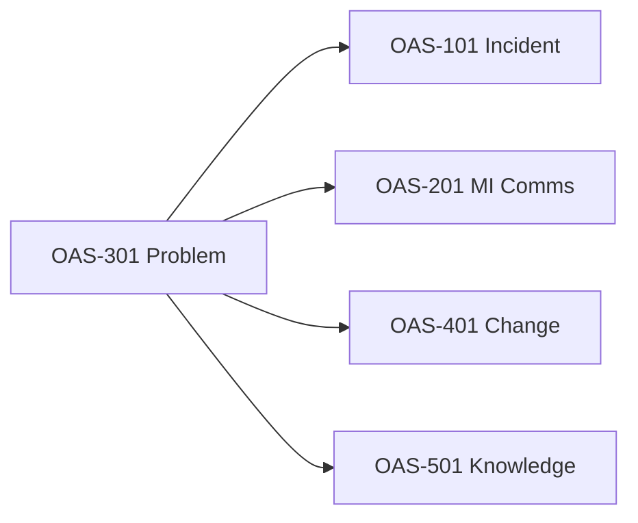
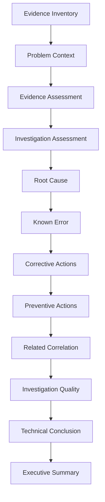
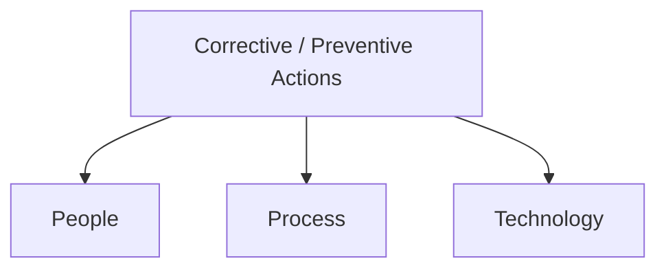

# OAS-301 Problem Analysis Methodology

## Purpose

This standard defines the methodology for analysing Problem investigations.

The purpose of OAS-301 is to evaluate the **quality, completeness, and evidential strength** of a Problem investigation rather than simply reviewing the Problem record.

OAS-301 provides an evidence-based framework for assessing:

- Investigation quality
- Root Cause determination
- Known Error documentation
- Corrective Actions
- Preventive Actions
- Risk of recurrence
- Investigation completeness

This methodology inherits all governance requirements defined in **OAS-000 Operational Analysis Standard**.

### What this methodology delivers

- A judgement on whether the investigation was rigorous.
- A rating of how well the stated Root Cause is supported by evidence.
- An assessment of Known Error, Corrective, and Preventive Actions.
- A residual risk-of-recurrence statement.
- Evidence-based recommendations to improve the investigation and the operation.

### What it is not

It is not a substitute for performing the investigation. It assesses an investigation that has (or has not) been done.

---

## Scope

This methodology applies to:

- Problem (PBI/PRB) records
- Root Cause Investigations
- Known Error investigations
- Service Improvement Reviews (SIR)
- Corrective and Preventive Action (CAPA) plans

OAS-301 complements:

- OAS-101 Incident Analysis
- OAS-201 Major Incident Communications

and provides investigation context for:

- OAS-401 Change Analysis
- OAS-501 Operational Knowledge Standard

Where Post Incident/Implementation Review (PIR) artefacts exist, they may be used as supporting evidence but are not a standalone OAS standard in Release 1.1.

---

## Analytical Responsibility



OAS-301 evaluates the investigation.

It does **not** assume that documented conclusions are correct.

The Problem record is treated as **evidence**, not as authority.

Conclusions shall be assessed against all available evidence.

---

## Guiding Principles

Every Problem analysis shall:

- Remain evidence based.
- Distinguish evidence from conclusions.
- Assess investigation quality independently from technical conclusions.
- Identify unsupported conclusions.
- Preserve operational chronology established by previous OAS methodologies.
- Document uncertainty where evidence is insufficient.

### Burden of Proof Principle

Conclusions documented within a Problem investigation are **not** accepted solely because they are recorded.

Each significant conclusion shall be evaluated against the available evidence.

Where evidence is insufficient, contradictory, or unavailable, the analysis shall explicitly document:

- Evidence reviewed
- Supporting observations
- Contradictory observations
- Confidence
- Impact on the investigation

The objective of OAS-301 is to evaluate both the quality of the investigation and the strength of its conclusions.

---

## Definitions

| Term | Definition |
|------|------------|
| Root Cause | The underlying reason the problem occurred. |
| Known Error | A documented fault with a known root cause and workaround. |
| Corrective Action | Action to remove the cause (People/Process/Technology). |
| Preventive Action | Action to stop recurrence of this or similar problems. |
| CAPA | Corrective and Preventive Action plan. |
| SIR | Service Improvement Review — governance review of the problem. |
| Recurrence Risk | Likelihood the fault returns given current state. |

---

## Inputs

### Mandatory

| Evidence | Purpose |
|----------|---------|
| Problem XML | Primary investigation record |

### Recommended

| Evidence | Purpose |
|----------|---------|
| Incident XML | Operational history |
| Major Incident XML | Major Incident context |
| OAS-101 Analysis | Established operational facts |
| OAS-201 Analysis | Communication and operational narrative |

### Optional

| Evidence | Purpose |
|----------|---------|
| Vendor RCA | External technical findings |
| Service Improvement Review (SIR) | Governance review |
| Known Error Record | Documented fault |
| Change XML | Related corrective implementation |
| Monitoring evidence | Technical validation |
| Logs | Technical evidence |
| Email (.eml) | Supporting communications |
| Teams Export | Investigation discussions |
| Analyst Notes | Supplementary evidence |

---

## Required Evidence

Each supplied evidence source shall be classified using the Evidence States model defined in OAS-000 §8.

| State | Meaning |
|---------|----------|
| Present | Available and analysed |
| Referenced | Mentioned but not supplied |
| Missing | Expected but unavailable |
| Not Applicable | Not required |

Evidence limitations shall be documented.

---

## Analysis Methodology



Every Problem investigation shall follow the analytical lifecycle below, then the assessment phases.

```text
Evidence Inventory
        │
        ▼
Problem Context
        │
        ▼
Evidence Assessment
        │
        ▼
Investigation Assessment
        │
        ▼
Root Cause Assessment
        │
        ▼
Known Error Assessment
        │
        ▼
Corrective Action Assessment
        │
        ▼
Preventive Action Assessment
        │
        ▼
Related Record Correlation
        │
        ▼
Investigation Quality Assessment
        │
        ▼
Technical Conclusion Assessment
        │
        ▼
Executive Summary
```

### Phase 1 — Problem Context

Document:

- Problem Number
- Title
- Current State
- Priority
- Assignment
- Business Service
- Configuration Items
- Related Incidents
- Related Major Incidents

Determine whether the Problem accurately reflects the operational issues identified in previous analyses.

---

### Phase 2 — Evidence Assessment

Inventory all available evidence.

For each evidence source evaluate:

- Relevance
- Completeness
- Correlation
- Reliability
- Contribution to the investigation

**Guidance:** Evidence shall be assessed without assuming authority based on source. A vendor RCA (tier 3) is useful but commercially interested; an internal log (tier 4) may be more neutral.

---

### Phase 3 — Investigation Assessment

Evaluate the investigation itself.

Assessment areas:

- Scope (was the right problem scoped?)
- Investigation planning (was there a plan?)
- SME engagement (were the right experts involved?)
- Technical analysis (was it rigorous?)
- Vendor engagement (was the vendor used well?)
- Supporting documentation (was it recorded?)
- Investigation traceability (can each step be followed?)

Determine whether the investigation has been conducted with sufficient rigour.

---

### Phase 4 — Root Cause Assessment

Evaluate the stated Root Cause.

Determine whether it is:

- **Supported** — multiple independent sources agree.
- **Partially Supported** — one source agrees; others silent or weak.
- **Not Supported** — evidence contradicts or is absent.
- **Unable to Determine** — insufficient evidence.

Document:

- Supporting evidence
- Contradictory evidence
- Evidence limitations
- Confidence

**Example — Supported:** Root cause "connection pool exhaustion" backed by app logs (pool saturation), APM (thread contention), and a confirmed config change removing the limit. → **Supported, High confidence.**

**Example — Not Supported:** Root cause "DNS" stated in the Problem record, but no DNS log, no vendor statement, and the incident timeline shows the fault began before any DNS event. → **Not Supported, Low/Unknown.**

---

### Phase 5 — Known Error Assessment

Assess:

- Has a Known Error been identified?
- Is it adequately documented?
- Is supporting evidence available?
- Is the failure condition clearly described?
- Is the operational impact understood?
- Is future reuse likely?

A Known Error is only valuable if someone encountering the symptom can find it and apply the workaround.

---

### Phase 6 — Corrective Action Assessment



Corrective Actions shall be evaluated across three domains.

#### People

- Skills
- Competencies
- Knowledge transfer
- Training
- Roles and responsibilities
- Resource capability

#### Process

- Governance
- Procedures
- Operational controls
- Documentation
- Approvals
- Compliance

#### Technology

- Infrastructure
- Applications
- Configuration
- Monitoring
- Automation
- Vendor products
- Platform improvements

For every Corrective Action assess:

- Relevance (does it address the cause?)
- Ownership (is someone accountable?)
- Feasibility (can it be done?)
- Traceability (does it link to the root cause?)
- Expected effectiveness

---

### Phase 7 — Preventive Action Assessment

Preventive Actions shall use the same People / Process / Technology framework.

Assess:

- Recurrence reduction
- Ownership
- Measurability
- Governance
- Sustainability
- Operational effectiveness

Preventive actions should reduce the chance of *this or similar* problems, not merely fix the one instance.

---

### Phase 8 — Service Improvement Review (SIR)

If SIR documentation is available evaluate:

- Evidence reviewed
- Decisions reached
- Executive Sponsor involvement
- Action ownership
- Governance outcomes
- Follow-up actions

If no SIR evidence is supplied:

Record as:

**Not Assessed**

---

### Phase 9 — Problem State Assessment

Adjust the analytical focus according to the Problem lifecycle state.

| State | Analytical Focus |
|---------|-----------------|
| New | Problem definition and evidence collection |
| In Progress | Investigation quality |
| Pending Review | Conclusion validation |
| Pending Preventive Action | Action assessment |
| Verification | Effectiveness validation |
| Closed | Final investigation assessment |

---

### Phase 10 — Related Record Correlation

Correlate findings with:

- Incidents
- Major Incidents
- Changes
- Vendor cases
- Known Errors
- Configuration Items
- Post Incident/Implementation Reviews (PIRs), where available

Identify:

- Supporting evidence
- Contradictory evidence
- Missing evidence
- New findings

---

### Phase 11 — Investigation Quality Assessment

Evaluate the investigation independently from technical conclusions.

| Area | Assessment |
|------|------------|
| Scope | |
| Evidence Collection | |
| Technical Analysis | |
| Documentation | |
| SME Engagement | |
| Governance | |
| Traceability | |

Overall Rating: Excellent / Good / Adequate / Poor. Provide supporting rationale.

---

### Phase 12 — Technical Conclusion Assessment

Determine whether available evidence supports:

- Root Cause
- Known Error
- Corrective Actions
- Preventive Actions

Possible outcomes:

- Fully Supported
- Partially Supported
- Insufficient Evidence
- Contradicted by Evidence

Every conclusion shall reference supporting evidence.

---

### Phase 13 — Risk of Recurrence

Evaluate residual operational risk.

Consider:

- Outstanding technical issues
- Incomplete actions
- Governance gaps
- Monitoring gaps
- Vendor dependencies
- Operational risks

Document residual risk and rationale.

---

## Worked Example (Illustrative)

**Problem:** PRB000789 — "Intermittent checkout 500 errors."

| Element | Evidence | Assessment |
|---------|----------|------------|
| Root Cause (stated) | "Bad deployment CHG001122" | Supported by deploy timestamp + error onset; **High**. |
| Known Error | Documented with workaround | Adequate; **Moderate** (workaround untested). |
| Corrective | Rollback CHG001122 + config fix | Relevant, owned, traceable; **High**. |
| Preventive | Add pre-deploy validation gate | Addresses recurrence; **Moderate** (not yet implemented). |
| Recurrence Risk | If gate not implemented | **Medium** residual. |

**Conclusion:** Investigation well conducted; corrective actions strong; preventive action and Known Error validation are the gaps. Overall confidence **High** for cause, **Moderate** for completeness.

---

## Findings (Analyst Conclusion)

Summarise:

- Investigation completeness
- Root Cause support
- Known Error quality
- Corrective Action assessment
- Preventive Action assessment
- Outstanding evidence
- Residual risks
- Additional investigation required
- Overall confidence

The conclusion shall distinguish confirmed findings from evidence limitations.

---

## Confidence Assessment

Assign confidence to significant conclusions using the OAS-000 Confidence Model (§10):

| Rating | Description |
|---------|-------------|
| High | Supported by multiple evidence sources |
| Moderate | Supported by one authoritative evidence source |
| Low | Limited supporting evidence |
| Unknown | Insufficient evidence |

Confidence shall never be implied. Root Cause, Known Error, Corrective, and Preventive conclusions shall each carry an explicit confidence rating.

---

## Recommendations

Recommendations shall:

- Improve investigation quality.
- Improve governance.
- Improve Corrective Actions.
- Improve Preventive Actions.
- Improve operational resilience.

Recommendations shall be evidence based.

---

## Quality Assurance Checklist

Before finalising verify:

- [ ] Evidence inventoried (and states classified)
- [ ] Related analyses reviewed (OAS-101 / OAS-201)
- [ ] Root Cause assessed
- [ ] Known Error assessed
- [ ] Corrective Actions assessed
- [ ] Preventive Actions assessed
- [ ] SIR reviewed (if available)
- [ ] Related records correlated
- [ ] Confidence assigned
- [ ] Recommendations evidence-based

---

## AI Operating Standard

When analysing a Problem investigation:

1. Inventory all evidence (classify Evidence States).
2. Inherit established operational facts from OAS-101.
3. Inherit the operational narrative from OAS-201.
4. Evaluate the investigation independently.
5. Assess Root Cause against evidence.
6. Assess Known Error against evidence.
7. Assess Corrective and Preventive Actions.
8. Correlate related records.
9. Identify unsupported conclusions.
10. Assign confidence to conclusions.
11. Produce an evidence-based executive assessment.

Never assume documented conclusions are correct.

Never infer technical findings that are unsupported by evidence.

Explicitly document uncertainty where evidence is incomplete.

---

## Related Standards

- OAS-000 Operational Analysis Standard Governance
- OAS-101 Incident Analysis Methodology
- OAS-201 Major Incident Communications Methodology
- OAS-401 Change Analysis Methodology
- OAS-501 Operational Knowledge Standard

---

## Related Knowledge Base

- OAS-KB-001 Operational Knowledge Templates
- OAS-KB-002 Analysis Checklists

---

## Revision History

| Version | Date | Summary | Author | Reviewer |
|----------|------|---------|---------|----------|
| 1.0 | 2026-07-23 | Initial approved release (restructured to Standard Document Structure; cross-references corrected) | | |
| 1.1 | 2026-07-23 | Elaborated for comprehensiveness: definitions, per-phase assessment guidance, Supported/Not-Supported examples, P/P/T action evaluation, worked example | | |

---

## Future Revision Register

| ID | Status | Priority | Proposed Version | Enhancement |
|----|--------|----------|------------------|-------------|
| OAS301-001 | Proposed | Medium | 1.2 | Investigation Evidence Traceability Matrix (map conclusions to supporting evidence) |
| OAS301-002 | Proposed | Low | 1.2 | Standardised Root Cause Confidence Templates |
| OAS301-003 | Proposed | Low | 2.0 | PIR Integration Guidance (when OAS-601 is authorised) |

---

End of Standard
