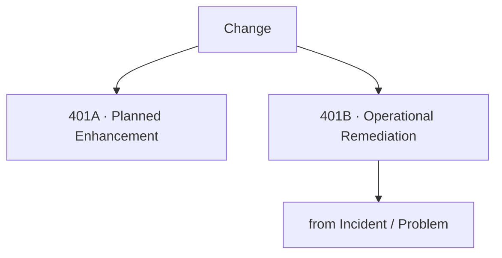
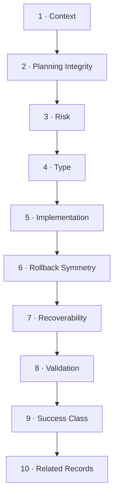
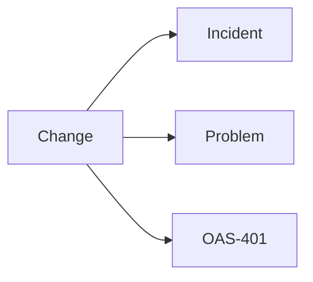

# OAS-401 Change Analysis Methodology

## Purpose

The Change Analysis Methodology establishes a structured, evidence-based approach for evaluating the planning, execution, governance, operational effectiveness, and outcomes of Change records.

The methodology supports both:

- Planned enhancements and new capabilities.
- Operational remediation resulting from Incidents or Problems.

The objective is to determine whether a Change achieved its intended outcome while maintaining service stability and adhering to organisational governance.

### What this methodology delivers

- An assessment of planning integrity.
- A judgement on whether risk and type were appropriate.
- An evaluation of execution versus plan.
- An assessment of rollback symmetry and recoverability.
- A success classification grounded in evidence.
- Evidence-based recommendations.

### What it is not

It evaluates the **Change itself**, not the organisational Change Management process, and not the technical root cause of any fault (that is OAS-301).

---

## Scope

This methodology applies to ServiceNow Change records including:

- Standard Changes
- Normal Changes
- Emergency Changes

It evaluates the Change record rather than the organisational Change Management process.

---

## Definitions

| Term | Definition |
|------|------------|
| Standard Change | Low-risk, pre-approved, repeatable. |
| Normal Change | Requires assessment and CAB approval. |
| Emergency Change | Urgent; expedited or post-approval. |
| Risk | Organisational risk classification (Low/Medium/High/Significant). |
| Rollback Symmetry | Rollback planning proportionate to implementation planning. |
| Recoverability | Ability to recover from failed implementation. |
| Success Classification | Successful / Partially Successful / Unsuccessful / Unconfirmed. |

---

## Guiding Principles

Change analysis shall:

- Be evidence based.
- Consider operational context.
- Evaluate planning and execution equally.
- Distinguish implementation success from business outcome.
- Identify opportunities for continual improvement.
- Preserve traceability to supporting evidence.

---

## Supported Change Intent

Changes should first be classified according to operational intent.

### 401A – Planned Enhancement

Examples: new functionality, platform enhancement, infrastructure improvement, planned maintenance, technical debt reduction, service optimisation. Typically implemented as **Normal Changes**.

### 401B – Operational Remediation

Changes introduced in response to operational events: incident remediation, major incident recovery, problem corrective actions, preventive improvements, risk reduction. Evaluate alongside related Incident and Problem records where available.

---

## Inputs

### Mandatory

- Change XML

### Optional Supporting Evidence

- Incident XML
- Major Incident XML
- Problem XML
- CAB notes
- Implementation plans
- Test evidence
- Validation evidence
- Rollback plan
- PIR documentation
- Vendor documentation
- Email (.eml)
- Timeline documents

---

## Required Evidence

Assess available evidence including:

- Change metadata
- Approval history
- Risk classification
- Change type
- Planned implementation window
- Actual implementation activities
- Validation activities
- Rollback planning
- Work notes
- Related records
- Closure information

Every evidence source listed above shall be classified using the Evidence States model defined in OAS-000 §8 — **Present**, **Referenced**, **Missing**, or **Not Applicable**. Unavailable evidence that may influence analytical confidence shall be documented explicitly.

---

## Analysis Methodology

### Phase 1 — Context

**Objective:** Understand intent before judging execution.

Establish:

- Business objective
- Technical objective
- Change intent (401A or 401B)
- Related operational events
- Service impact

**Guidance:** A remediation change (401B) should be traced to the Incident/Problem it resolves. If no related record exists, that is a traceability gap.

---

### Phase 2 — Planning Integrity

**Objective:** Judge whether the change was planned well.

Assess:

- Scope clearly defined
- Success criteria documented
- Risk identified
- Testing completed
- Validation planned
- Rollback defined
- Communications planned
- Resource planning

**Guidance:** Planning deficiencies should be identified separately from execution issues. A change can be perfectly planned yet fail in execution, or poorly planned yet succeed by luck — the analysis must separate the two.

---

### Phase 3 — Risk Assessment

**Objective:** Determine whether the assigned Change Risk reflected reality.

Approved classifications: Low / Medium / High / Significant.

Assess:

- Risk identification
- Risk treatment
- Residual operational risk
- Actual implementation risk

**Guidance:** Where risk appears inconsistent with implementation complexity or outcome, document the observation. Example: a "Medium" risk assigned to a database schema change with customer impact and no tested rollback suggests under-classification.

---

### Phase 4 — Change Classification

**Objective:** Confirm the Change Type was appropriate.

Approved classifications: Standard / Normal / Emergency.

Assess whether the selected Change Type reflected the nature and urgency of the implementation.

**Guidance:** An "Emergency" type used to bypass CAB for a non-urgent change is a governance finding. A "Standard" type applied to a novel, never-before-run procedure is a misclassification.

---

### Phase 5 — Implementation Assessment

**Objective:** Evaluate execution versus the approved plan.

Assess:

- Planned activities completed
- Implementation followed approved plan
- Deviations recorded
- Technical issues encountered
- Operational impacts
- Stakeholder communication
- Schedule adherence

**Guidance:** Deviations are not inherently bad, but unrecorded deviations are a governance and evidence-quality defect.

---

### Phase 6 — Rollback Symmetry

**Objective:** Evaluate whether rollback planning matched implementation planning.

Rollback planning should demonstrate a level of detail proportionate to the implementation plan.

Assess:

- Rollback documented
- Rollback validated
- Rollback decision criteria defined
- Recovery activities documented
- Dependencies identified

**Guidance:** Where implementation planning is comprehensive but rollback planning is minimal, document the imbalance as an operational risk. Example: a 12-step implementation with a one-line "rollback if needed" is asymmetric.

---

### Phase 7 — Recoverability Assessment

**Objective:** Judge the organisation's ability to recover from failure.

Assess:

- Recovery procedures
- Service restoration approach
- Configuration recovery
- Data recovery
- Communication during recovery

Recoverability should be considered independently of implementation success. A successful change can still reveal poor recoverability for the *next* failure.

---

### Phase 8 — Operational Validation

**Objective:** Confirm the change actually achieved its outcome.

Assess:

- Technical validation
- Functional validation
- Service validation
- Monitoring
- Business confirmation
- Closure evidence

**Guidance:** Successful implementation should **not** be assumed solely because the Change record was closed. Look for validation evidence (tests passed, service metrics normal, business sign-off).

---

### Phase 9 — Success Classification

**Objective:** Assign the evidence-based outcome.

Approved classifications:

- Successful
- Partially Successful
- Unsuccessful
- Unconfirmed

**Guidance:** If evidence suggests a different outcome than the recorded classification, document this as a recommendation rather than altering the official classification. The analysis records its own assessment; it does not rewrite the record.

---

### Phase 10 — Related Record Assessment

Where available, evaluate consistency with:

- OAS-101 Incident Analysis
- OAS-301 Problem Analysis

Confirm that:

- Corrective actions align with identified root causes.
- Preventive improvements address recurrence risks.
- Related records remain consistent.

---

## Worked Example (Illustrative)

**Change:** CHG001122 — "Deploy ordersvc v4.2 (remediation for INC0012345)."

| Element | Evidence | Assessment |
|---------|----------|------------|
| Intent | 401B remediation | Linked to INC0012345; traceable. |
| Risk | Recorded "Medium" | Underestimated — customer-facing, no tested rollback → finding. |
| Planning | Plan present; rollback 1 line | Rollback asymmetry → risk. |
| Execution | Deployed 02:30; incident began 02:40 | Causality supported (Moderate). |
| Validation | Health checks passed post-fix | Successful outcome. |
| Success class | Recorded "Successful" | Consistent with evidence. |

**Conclusion:** Outcome successful but planning/risk/rollback weak. Confidence: **High** for outcome, **Moderate** for causality.

---

## Findings

Identify:

- Planning strengths
- Planning weaknesses
- Governance observations
- Technical observations
- Operational observations
- Risks
- Positive practices

Separate observations from conclusions.

---

## Confidence Assessment

Assign a confidence rating to every significant finding using the OAS-000 Confidence Model (§10):

| Rating | Description |
|--------|-------------|
| High | Supported by multiple independent evidence sources |
| Moderate | Supported by one authoritative source |
| Low | Limited supporting evidence |
| Unknown | Evidence unavailable |

Confidence shall never be implied. Where evidence is limited or contradictory, record the affected findings as **Low** or **Unknown** and state the reason explicitly. The confidence assessment shall be reflected in the analysis outputs (OAS-000 §16).

---

## Recommendations

Recommendations should be evidence based and prioritised.

Typical categories:

- Planning improvements
- Testing improvements
- CAB governance
- Risk management
- Rollback planning
- Validation improvements
- Documentation improvements
- Operational readiness

**Example:** "Require a validated rollback for all customer-facing changes regardless of recorded risk (R1, High, based on CHG001122 asymmetry)."

---

## Lessons Learned

Capture lessons that improve future Changes.

Lessons should distinguish:

- Planning
- Governance
- Technical implementation
- Validation
- Recoverability
- Operational communication

---

## Quality Assurance Checklist

Before completing the analysis verify:

- [ ] Change intent established
- [ ] Required evidence reviewed (and states classified)
- [ ] Planning assessed
- [ ] Risk evaluated (and appropriateness judged)
- [ ] Change Type confirmed
- [ ] Rollback symmetry evaluated
- [ ] Recoverability assessed
- [ ] Operational validation completed
- [ ] Success classification reviewed
- [ ] Related records considered
- [ ] Findings evidence based
- [ ] Confidence assigned to findings
- [ ] Recommendations supported by evidence

---

## AI Operating Standard

When analysing a Change:

1. Establish operational context.
2. Validate evidence completeness (classify Evidence States).
3. Assess planning before execution.
4. Evaluate implementation objectively.
5. Assess rollback independently.
6. Assess recoverability independently.
7. Validate operational outcomes.
8. Distinguish observations from findings.
9. Assign confidence to findings.
10. Produce evidence-based recommendations.
11. Identify lessons learned.

The AI shall not infer successful implementation solely from record closure and shall explicitly identify limitations where evidence is incomplete.

---

## Related Standards

- OAS-000 Operational Analysis Standard Governance
- OAS-101 Incident Analysis Methodology
- OAS-301 Problem Analysis Methodology
- OAS-501 Operational Knowledge Standard

---

## Related Knowledge Base

- OAS-KB-001 Operational Knowledge Templates
- OAS-KB-002 Analysis Checklists

---

## Revision History

| Version | Date | Summary | Author | Reviewer |
|----------|------|---------|---------|----------|
| 1.0 | 2026-07-23 | Initial approved release | | |
| 1.1 | 2026-07-23 | Elaborated for comprehensiveness: definitions, per-phase guidance, risk/rollback/success examples, worked example | | |

---

## Future Revision Register

| ID | Status | Priority | Proposed Version | Enhancement |
|----|--------|----------|------------------|-------------|
| OAS401-001 | Proposed | Medium | 1.2 | Change Success Indicators Framework |
| OAS401-002 | Proposed | Medium | 1.2 | CAB Decision Quality Assessment |
| OAS401-003 | Proposed | Low | 2.0 | Implementation Maturity Model |
| OAS401-004 | Proposed | Low | 2.0 | Change Metrics Guidance |

---

End of Standard
